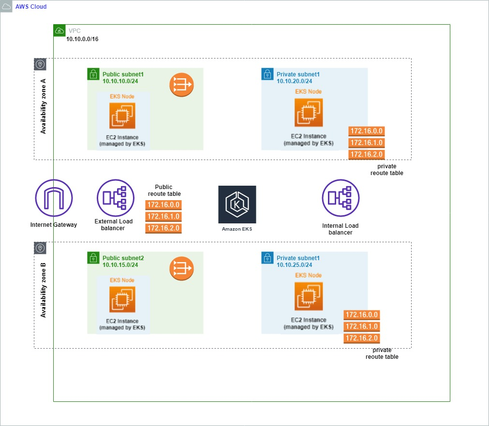
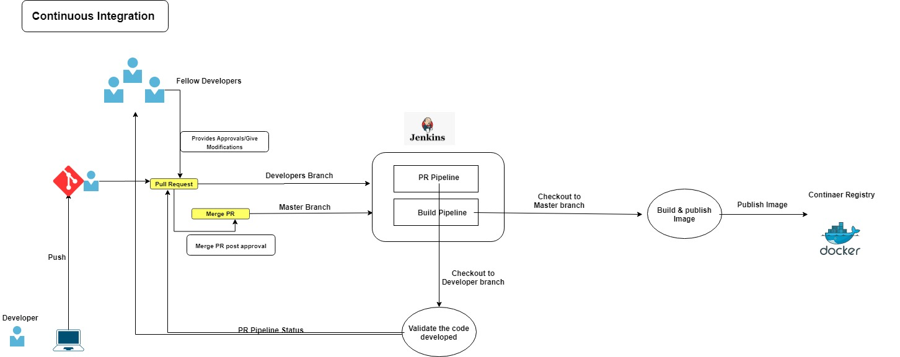
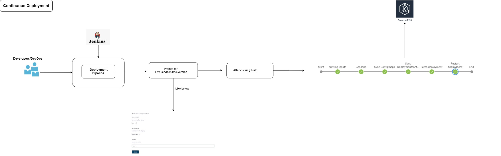
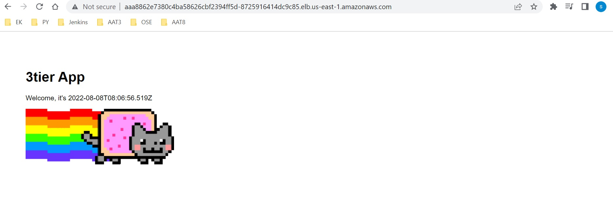
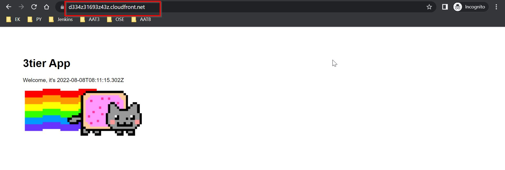
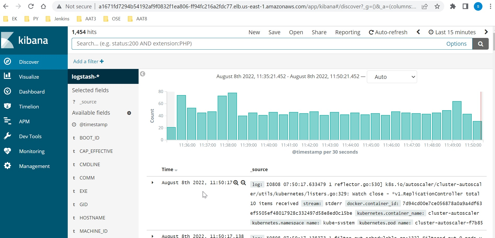
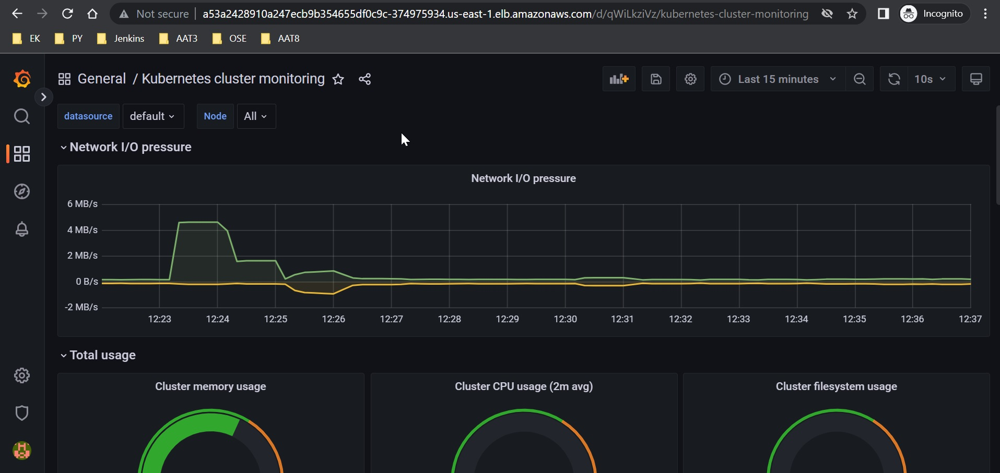

# Follow the below instructions to build and deploy 3 tier application 

## Pre-requisites 

### Creating workstation 
Make sure that you are having a workstation with below packages
- git
-	ansible
- helm
- terraform
- python3
- pip3
- awscli
- kubectl
- packer


## Building Microserivce Platform - EKS:
→ make sure you are configuring aws cli before you start

```sh 
→ git clone https://github.com/shan5a6/toptal-task.git
→ cd toptal-task/eks-infra
→ terraform apply -auto-approve
```
Note: It take around 5-10 minutes to build the eks cluster
```sh
→ aws eks update-kubeconfig --name clustername --region us-east-1 # update the kubeconfig 
```
##### EKS Architecture


## Building CICD Platform - Jenkins:

```sh
→ cd jenkins-infra/jenkins
→ packer build -var-file=variables.json ami.json
Collect the ami from above output and do the changes to python code 
→ cd jenkins-infra/python/ec2
→ python instance_creation.py
→ kubectl apply -f devops/jenkins-configs/jenkins-sa.yaml
```
Once jenkins is up make sure that you are configuring all the neccessary tokens,pipelines,plugins,jobs
configure the jobs with pipelines from 'devops/app-pipelines/'
configure the webhook for pr,push events in git so that jenkins will build the application

##### CICD Architecture




## Building Application environments in EKS :

```sh
→ cd devops/ansible
Make sure that you are giving the application name and enviroonments required in our case we took dev,sit,prod
  in vars/applications.yaml file
→ ansible-playbook 	main.yaml
this will create neccessary namespaces & configure the roles,rolebindings in the namespaces
```

```sh
Now lets configure the application in respective namespaces
→ cd devops/app-configs
→ cd toptal-dev
→ for i in configmaps secrets volumes deploymentconfigs services hpa;do kubectl apply -Rf $i/;done
Repeate the above steps for sit,prod
```

#### Post deployement application looks like below 


Configuring database backup based up on your requirement

```sh
Make sure that you are building your own image using the dockerfile FYR
→ kubectl apply -f devops/app-config/dbbackup/cronjob
```

## Configuring CDN for production:

```sh
→ cd devops/terraform
Update the production service url (LB) in the locals and apply the configurations
→ terraform apply -auto-approve
```
#### Post deployement you can access application with cdn url directly



## Configuring ELK setup for logging:

```sh
→ cd devops/logging
→ bash create.sh run
```
Note: You can access kibana with service lb url



## Configuring Monitoring :

```sh
→ cd devops/monitoring
→ check the text document and follow the instructions as per the document 
```
Note: You can access grafana with service lb url


